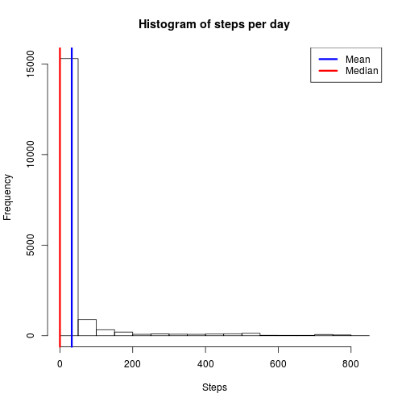
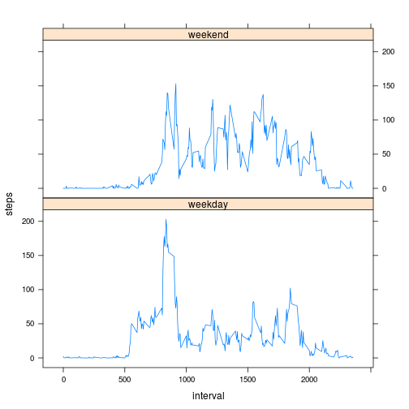

# Reproducible Research: Peer Assessment 1


## Loading and preprocessing the data


```r
classes <- c("integer", "character", "integer")
data <- read.csv("activity.csv", header = TRUE, colClasses = classes)
str(data)
```

```
## 'data.frame':	17568 obs. of  3 variables:
##  $ steps   : int  NA NA NA NA NA NA NA NA NA NA ...
##  $ date    : chr  "2012-10-01" "2012-10-01" "2012-10-01" "2012-10-01" ...
##  $ interval: int  0 5 10 15 20 25 30 35 40 45 ...
```

```r
head(data)
```

```
##   steps       date interval
## 1    NA 2012-10-01        0
## 2    NA 2012-10-01        5
## 3    NA 2012-10-01       10
## 4    NA 2012-10-01       15
## 5    NA 2012-10-01       20
## 6    NA 2012-10-01       25
```

```r
tail(data)
```

```
##       steps       date interval
## 17563    NA 2012-11-30     2330
## 17564    NA 2012-11-30     2335
## 17565    NA 2012-11-30     2340
## 17566    NA 2012-11-30     2345
## 17567    NA 2012-11-30     2350
## 17568    NA 2012-11-30     2355
```

```r
summary(data)
```

```
##      steps           date              interval   
##  Min.   :  0.0   Length:17568       Min.   :   0  
##  1st Qu.:  0.0   Class :character   1st Qu.: 589  
##  Median :  0.0   Mode  :character   Median :1178  
##  Mean   : 37.4                      Mean   :1178  
##  3rd Qu.: 12.0                      3rd Qu.:1766  
##  Max.   :806.0                      Max.   :2355  
##  NA's   :2304
```

### Transform data$date from character class to date class

```r
data$date <- strptime(data$date, "%Y-%m-%d")
data$date <- as.Date(data$date, format = "%Y-%m-%d")
str(data)
```

```
## 'data.frame':	17568 obs. of  3 variables:
##  $ steps   : int  NA NA NA NA NA NA NA NA NA NA ...
##  $ date    : Date, format: "2012-10-01" "2012-10-01" ...
##  $ interval: int  0 5 10 15 20 25 30 35 40 45 ...
```

```r
head(data)
```

```
##   steps       date interval
## 1    NA 2012-10-01        0
## 2    NA 2012-10-01        5
## 3    NA 2012-10-01       10
## 4    NA 2012-10-01       15
## 5    NA 2012-10-01       20
## 6    NA 2012-10-01       25
```

## What is mean total number of steps taken per day?

### 1. Mean of the number of steps taken per day

```r
steps.mean = mean(data$steps, na.rm = TRUE)
steps.mean
```

```
## [1] 37.38
```

### 2. Median of the number of steps taken per day

```r
steps.median = median(data$steps, na.rm = TRUE)
steps.median
```

```
## [1] 0
```

### 3. Histogram of the number of steps taken per day

```r
hist(data$steps, xlab="Steps", main="Histogram of steps per day")
abline(v=steps.mean, col="blue", lwd=3)
abline(v=steps.median, col="red", lwd=3)
legend("topright", c("Mean", "Median"), col=c("blue", "red"), lwd=3)
```

 


## What is the average daily activity pattern?

### 1. Time serie plot

```r
data.interval.means <- sapply(split(data, data$interval), function(x) mean(x[,1], na.rm = TRUE))
plot(names(data.interval.means), data.interval.means, type="l", xlab="5-minute interval", ylab="Average number of steps", main="Average number of steps for each 5-minute intervals")
```

 

### 2. 5-minute interval which contains the maximum number of steps

```r
max.steps <- data.interval.means[which.max(data.interval.means)]
max.steps
```

```
##   835 
## 206.2
```

The 835-th 5-minute interval has the maximum value 206.1698.

## Imputing missing values

### 1. Number of missing values

```r
sum(is.na(data))
```

```
## [1] 2304
```

### 2. Replace missing values with the mean of their day or zero if their mean is NA

```r
replaceByMeans <- function(data) {
    result <- data
    # Compute the steps mean of each day. if a mean for a day is NA we set it to zero
    data.means <- sapply(split(data, data$date), function(x) mean(x[,1], na.rm = TRUE))
    good <- complete.cases(data.means)
    data.means[good == FALSE] <- 0
    # Replace all NA values by their respective means (daily means)
    for(i in 1:length(data.means)) {
        result$steps[is.na(result$steps) & result$date == names(data.means[i])] <- data.means[[i]]
    }
    result
}
```

### 3. New data set

```r
data2 <- replaceByMeans(data)
head(data2)
```

```
##   steps       date interval
## 1     0 2012-10-01        0
## 2     0 2012-10-01        5
## 3     0 2012-10-01       10
## 4     0 2012-10-01       15
## 5     0 2012-10-01       20
## 6     0 2012-10-01       25
```

```r
tail(data2)
```

```
##       steps       date interval
## 17563     0 2012-11-30     2330
## 17564     0 2012-11-30     2335
## 17565     0 2012-11-30     2340
## 17566     0 2012-11-30     2345
## 17567     0 2012-11-30     2350
## 17568     0 2012-11-30     2355
```

```r
summary(data2)
```

```
##      steps            date               interval   
##  Min.   :  0.0   Min.   :2012-10-01   Min.   :   0  
##  1st Qu.:  0.0   1st Qu.:2012-10-16   1st Qu.: 589  
##  Median :  0.0   Median :2012-10-31   Median :1178  
##  Mean   : 32.5   Mean   :2012-10-31   Mean   :1178  
##  3rd Qu.:  0.0   3rd Qu.:2012-11-15   3rd Qu.:1766  
##  Max.   :806.0   Max.   :2012-11-30   Max.   :2355
```

### 4. Histogram and comments

#### 4.1 Mean of the number of steps taken per day

```r
steps.mean2 <- mean(data2$steps, na.rm = TRUE)
steps.mean2
```

```
## [1] 32.48
```

#### 4.2 Median of the number of steps taken per day

```r
steps.median2 <- median(data2$steps, na.rm = TRUE)
steps.median2
```

```
## [1] 0
```

#### 4.3 Histogram of the number of steps taken per day

```r
hist(data2$steps, xlab="Steps", main="Histogram of steps per day")
abline(v=steps.mean2, col="blue", lwd=3)
abline(v=steps.median2, col="red", lwd=3)
legend("topright", c("Mean", "Median"), col=c("blue", "red"), lwd=3)
```

 

The medians are the same in both parts of the assignment (median1 =  0, median2 = 0). The mean in the second part of the assignment (mean2 = 32.48) is lesser than the mean in the first part of the assignment (mean1 = 37.3826). Imputing missing data impacts the mean which is a less robust mesure than the median.

## Are there differences in activity patterns between weekdays and weekends?

### 1. Add new 2 level factor "weekday"/"weekend"

```r
table(weekdays(data2$date))
```

```
## 
## dimanche    jeudi    lundi    mardi mercredi   samedi vendredi 
##     2304     2592     2592     2592     2592     2304     2592
```

```r
# Create a boolean list for french weekend days: saturday (samedi) and sunday (dimanche)
weekends <- (weekdays(data2$date) == "samedi") | (weekdays(data2$date) == "dimanche")
table(weekends)
```

```
## weekends
## FALSE  TRUE 
## 12960  4608
```

```r
data2$day[weekends == FALSE] <- "weekday"
data2$day[weekends == TRUE] <- "weekend"
data2$day <- as.factor(data2$day)
summary(data2)
```

```
##      steps            date               interval         day       
##  Min.   :  0.0   Min.   :2012-10-01   Min.   :   0   weekday:12960  
##  1st Qu.:  0.0   1st Qu.:2012-10-16   1st Qu.: 589   weekend: 4608  
##  Median :  0.0   Median :2012-10-31   Median :1178                  
##  Mean   : 32.5   Mean   :2012-10-31   Mean   :1178                  
##  3rd Qu.:  0.0   3rd Qu.:2012-11-15   3rd Qu.:1766                  
##  Max.   :806.0   Max.   :2012-11-30   Max.   :2355
```

### 2. Difference in activity pattern between weekdays and weekends

```r
data2.days <- split(data2, data2$day)
summary(data2.days)
```

```
##         Length Class      Mode
## weekday 4      data.frame list
## weekend 4      data.frame list
```

```r
tmp <- data.frame(interval = as.integer(levels(as.factor(data2$interval))))
data3 <- cbind(tmp, steps = sapply(split(data2.days$weekday, data2.days$weekday$interval), function(x) mean(x[,1], na.rm = TRUE)), day = rep("weekday",1:length(tmp)))
data3 <- rbind(data3, cbind(tmp, steps = sapply(split(data2.days$weekend, data2.days$weekend$interval), function(x) mean(x[,1], na.rm = TRUE)), day = rep("weekend", 1:length(tmp))))
str(data3)
```

```
## 'data.frame':	576 obs. of  3 variables:
##  $ interval: int  0 5 10 15 20 25 30 35 40 45 ...
##  $ steps   : num  2.0222 0.4 0.1556 0.1778 0.0889 ...
##  $ day     : Factor w/ 2 levels "weekday","weekend": 1 1 1 1 1 1 1 1 1 1 ...
```

```r
head(data3)
```

```
##    interval   steps     day
## 0         0 2.02222 weekday
## 5         5 0.40000 weekday
## 10       10 0.15556 weekday
## 15       15 0.17778 weekday
## 20       20 0.08889 weekday
## 25       25 1.31111 weekday
```

```r
tail(data3)
```

```
##       interval  steps     day
## 23301     2330  1.062 weekend
## 23351     2335 11.000 weekend
## 23401     2340  5.875 weekend
## 23451     2345  1.625 weekend
## 23501     2350  0.000 weekend
## 23551     2355  0.000 weekend
```

```r
library(lattice)
xyplot(steps ~ interval | day, data = data3, layout = c(1,2), type = "l")
```

 

In average, it seems to have more activities on weekdays than weekends up to the 1000-th 5-minute interval, and after this interval much more activities on weekends than weekdays. Perhaps the profile has a sedentary job on weekdays and perform much more physical activities on weekdays.
